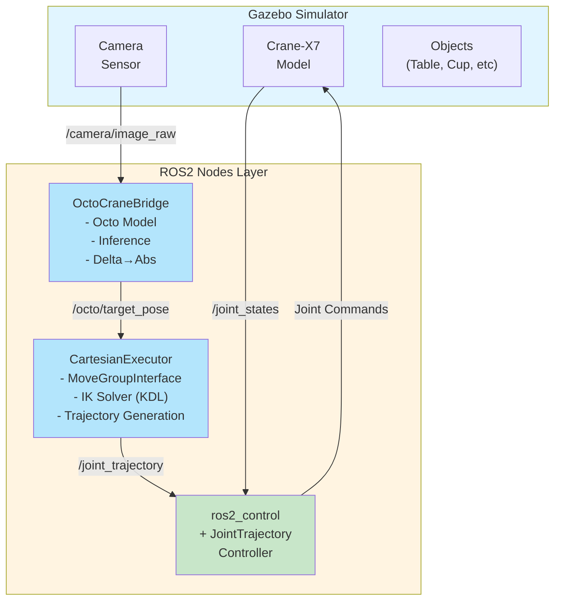
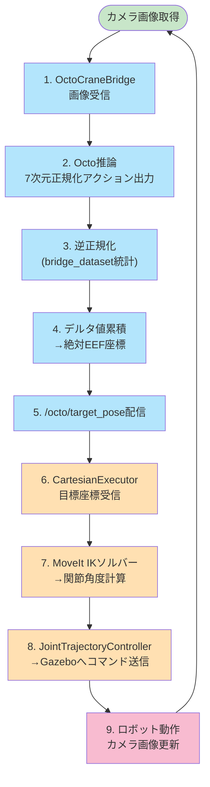
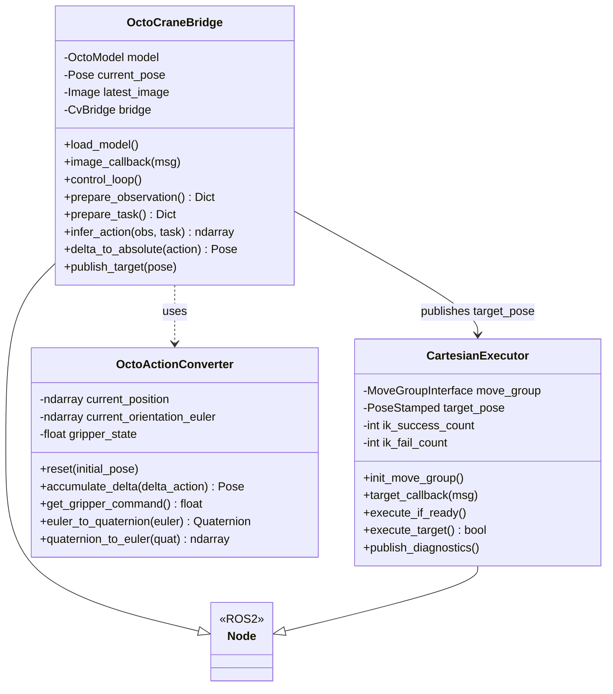

# Octo-Crane-X7統合システム 設計書

**バージョン:** 1.0  
**作成日:** 2026-01-21  
**ステータス:** Design Phase

---

## 目次

1. [概要](#概要)
2. [システムアーキテクチャ](#システムアーキテクチャ)
3. [クラス設計](#クラス設計)
4. [ROSインターフェース](#rosインターフェース)
5. [座標変換](#座標変換)
6. [実装手順](#実装手順)
7. [テスト計画](#テスト計画)

---

## 概要

### 目的
Octoモデルが出力する7次元デルタアクション（Δx, Δy, Δz, Δyaw, Δpitch, Δroll, grasp）を、GazeboシミュレータまたはリアルのCrane-X7ロボットで実行可能な関節制御コマンドに変換するシステムを構築する。

### スコープ
- **Phase 1**: Gazeboシミュレータでの動作確認（本設計の対象）
- **Phase 2**: 実機での動作確認（将来）
- **Phase 3**: ファインチューニング対応（将来）

### 設計方針
1. **シンプルさ優先**: 固定周期（10Hz）の同期設計
2. **既存インフラ活用**: MoveIt、ros2_control、Gazeboを最大限利用
3. **段階的改善**: 基本動作確認後に機能追加
4. **デバッグ容易性**: ログ、可視化、診断機能を充実

### 主要な技術選定

| 項目 | 選定内容 | 理由 |
|------|----------|------|
| データセット統計 | bridge_dataset | WidowXロボット（6DOF+gripper）がCrane-X7に近い |
| 制御周期 | 10Hz（固定） | Octo推論速度とのバランス、シンプルな実装 |
| プログラミング言語 | Python | Octoモデル、ROS2の両方で利用可能 |
| IKソルバー | KDL (MoveIt標準) | 既存設定をそのまま利用可能 |
| 座標系 | ロボットベース座標系 | Crane-X7の標準設定に準拠 |
| 安全機構 | Phase 1では未実装 | 基本動作確認を優先 |

---

## システムアーキテクチャ

### 全体構成図



### データフロー



### コンポーネント責任分担

| コンポーネント | 責任 | 入力 | 出力 |
|--------------|------|------|------|
| **OctoCraneBridge** | Octo推論、座標変換 | Camera画像、言語指令 | 目標EEF座標 |
| **CartesianExecutor** | IK計算、ロボット制御 | 目標EEF座標 | 関節角度コマンド |
| **MoveIt** | 動作計画、IK | 目標座標 | 関節軌道 |
| **ros2_control** | 低レベルモーター制御 | 関節軌道 | モーターコマンド |
| **Gazebo** | 物理シミュレーション | モーターコマンド | センサーデータ |

---

## クラス設計

### クラス図



### 1. OctoCraneBridge

**継承**: `rclpy.node.Node`

**役割**: Octoモデルのラッパー、推論、デルタ値の累積と座標変換

**責務**:
- Octoモデルのロードと管理
- カメラ画像の受信と前処理
- Octo推論の実行（10Hz周期）
- デルタアクションの累積による絶対座標計算
- 目標EEF座標の配信

**購読トピック**:
- `/camera/image_raw` (sensor_msgs/Image): カメラ画像
- `/joint_states` (sensor_msgs/JointState): 現在の関節状態

**配信トピック**:
- `/octo/target_pose` (geometry_msgs/PoseStamped): 目標EEF座標
- `/octo/debug/action` (std_msgs/Float64MultiArray): デルタアクション（デバッグ用）
- `/octo/debug/normalized_action` (std_msgs/Float64MultiArray): 正規化アクション

**パラメータ**:
- `model_name`: Octoモデル名（デフォルト: "hf://rail-berkeley/octo-small-1.5"）
- `dataset_stats`: 正規化統計名（デフォルト: "bridge_dataset"）
- `control_frequency`: 制御周波数Hz（デフォルト: 10.0）
- `language_instruction`: タスク指令（デフォルト: "pick up the cup"）

**主要メソッド**:
- `load_model()`: Octoモデルをロード
- `image_callback(msg)`: カメラ画像を受信
- `control_loop()`: メイン制御ループ（10Hz）
- `prepare_observation() -> Dict`: 観測データを[1,2,256,256,3]形式に変換
- `prepare_task() -> Dict`: 言語指令を含むタスク辞書を作成
- `infer_action(obs, task) -> ndarray[7]`: Octo推論を実行し7次元アクションを取得
- `delta_to_absolute(action) -> Pose`: デルタ値を累積して絶対座標に変換
- `publish_target(pose)`: 目標座標を配信

**内部状態**:
- `model`: ロード済みOctoModel
- `current_pose`: 現在のEEF絶対座標（累積用）
- `latest_image`: 最新のカメラ画像
- `rng`: JAX乱数生成器


---

### 2. CartesianExecutor

**継承**: `rclpy.node.Node`

**役割**: MoveItを使用してIK計算とロボット制御を実行

**責務**:
- 目標EEF座標の受信
- MoveItのIKソルバーによる関節角度計算
- 軌道生成と実行
- 実行統計の収集と診断情報の配信

**購読トピック**:
- `/octo/target_pose` (geometry_msgs/PoseStamped): 目標EEF座標

**配信トピック**:
- `/diagnostics` (diagnostic_msgs/DiagnosticArray): 診断情報

**パラメータ**:
- `planning_group`: MoveItのプランニンググループ（デフォルト: "arm"）
- `max_velocity_scaling`: 速度スケーリング（デフォルト: 0.5）
- `max_acceleration_scaling`: 加速度スケーリング（デフォルト: 0.5）
- `ik_timeout`: IKタイムアウト秒（デフォルト: 0.05）

**主要メソッド**:
- `init_move_group()`: MoveGroupInterfaceの初期化と設定
- `target_callback(msg)`: 目標座標を受信してバッファに格納
- `execute_if_ready()`: 目標が準備できていれば実行
- `execute_target() -> bool`: IK計算、軌道生成、実行の一連の処理
- `publish_diagnostics()`: IK成功率や実行時間などの統計を配信

**内部状態**:
- `move_group`: MoveGroupInterfaceインスタンス
- `target_pose`: 受信した目標座標
- `ik_success_count`: IK成功回数
- `ik_fail_count`: IK失敗回数
- `last_execution_time`: 最後の実行時間

---

### 3. OctoActionConverter

**役割**: 座標変換のユーティリティクラス（OctoCraneBridgeから利用可能）

**責務**:
- デルタ値の累積管理
- オイラー角とQuaternion間の変換
- グリッパー値の関節角度への変換
- 初期姿勢のリセット機能

**主要メソッド**:
- `reset(initial_pose)`: 初期姿勢を設定
- `accumulate_delta(delta_action) -> Pose`: デルタ値を累積して絶対座標を返す
- `get_gripper_command() -> float`: グリッパー値(0-1)を関節角度(rad)に変換
- `euler_to_quaternion(euler) -> Quaternion`: オイラー角からQuaternionへ変換
- `quaternion_to_euler(quat) -> ndarray`: QuaternionからオイラーI角へ変換

**内部状態**:
- `current_position`: 現在の位置[x, y, z]
- `current_orientation_euler`: 現在の姿勢[yaw, pitch, roll]
- `gripper_state`: グリッパー状態(0=閉, 1=開)

---

## ROSインターフェース

### トピック定義

| トピック名 | メッセージ型 | 方向 | 説明 |
|-----------|------------|------|------|
| `/camera/image_raw` | `sensor_msgs/Image` | Subscribe | カメラ画像 |
| `/joint_states` | `sensor_msgs/JointState` | Subscribe | 現在の関節状態 |
| `/octo/target_pose` | `geometry_msgs/PoseStamped` | Publish/Subscribe | 目標EEF座標 |
| `/octo/debug/action` | `std_msgs/Float64MultiArray` | Publish | デルタアクション（デバッグ） |
| `/octo/debug/normalized_action` | `std_msgs/Float64MultiArray` | Publish | 正規化アクション（デバッグ） |
| `/diagnostics` | `diagnostic_msgs/DiagnosticArray` | Publish | システム診断情報 |
| `/crane_x7_arm_controller/joint_trajectory` | `trajectory_msgs/JointTrajectory` | Publish | 関節軌道コマンド |

### パラメータ定義

#### OctoCraneBridge

```yaml
octo_crane_bridge:
  ros__parameters:
    model_name: "hf://rail-berkeley/octo-small-1.5"
    dataset_stats: "bridge_dataset"
    control_frequency: 10.0
    language_instruction: "pick up the cup"
    initial_pose:
      position: [0.3, 0.0, 0.3]  # [x, y, z] in meters
      orientation: [0.0, 0.0, 0.0, 1.0]  # [x, y, z, w] quaternion
```

#### CartesianExecutor

```yaml
cartesian_executor:
  ros__parameters:
    planning_group: "arm"
    max_velocity_scaling: 0.5
    max_acceleration_scaling: 0.5
    ik_timeout: 0.05
```

---

## 座標変換

### 1. Octoアクションの構成

```
action[0:3]  : [Δx, Δy, Δz]           位置デルタ (meters)
action[3:6]  : [Δyaw, Δpitch, Δroll]  姿勢デルタ (radians)
action[6]    : grasp                   グリッパー (0=closed, 1=open)
```

### 2. デルタ値の累積

```python
# 時刻tでの絶対座標
position[t] = position[t-1] + delta_position[t]
orientation[t] = orientation[t-1] + delta_orientation[t]

# 実装例
current_x += delta_x
current_y += delta_y
current_z += delta_z
```

### 3. オイラー角⇔Quaternion変換

**オイラー角→Quaternion:**
```python
from scipy.spatial.transform import Rotation as R

# YawPitchRoll (ZYX順序) からQuaternionへ
euler = [yaw, pitch, roll]  # radians
rot = R.from_euler('ZYX', euler)
quat = rot.as_quat()  # [x, y, z, w]
```

**Quaternion→オイラー角:**
```python
# QuaternionからYawPitchRollへ
quat = [x, y, z, w]
rot = R.from_quat(quat)
euler = rot.as_euler('ZYX')  # [yaw, pitch, roll]
```

### 4. グリッパー値の変換

```python
# Octoの出力 (0-1) → グリッパー関節角度
grasp_value = action[6]  # 0.0 ~ 1.0

# Crane-X7グリッパー: 0度(閉) ~ 90度(開)
gripper_angle = grasp_value * (np.pi / 2)  # 0 ~ π/2 radians

# または二値化
if grasp_value > 0.5:
    gripper_command = "open"
else:
    gripper_command = "close"
```

### 5. 座標系の対応

| 座標系 | 定義 | 使用箇所 |
|--------|------|---------|
| **World座標系** | Gazeboワールドの原点 | シミュレーション |
| **Base座標系** | ロボットベースリンク (`crane_x7_mounting_plate_link`) | MoveIt、IK |
| **EEF座標系** | エンドエフェクタ (`crane_x7_gripper_base_link`) | 目標設定 |

**重要**: Octoの出力はロボットベース座標系を想定しているため、特別な変換は不要。

---

## 実装手順

### Phase 1: 基本セットアップ

**ステップ1-1: パッケージ構造の作成**
```bash
cd ~/crane_x7_ws/src/crane_x7_ros/crane_x7_examples
mkdir -p scripts/octo_integration
touch scripts/octo_integration/__init__.py
```

**ステップ1-2: 依存関係の確認**
```bash
# requirements.txtを作成
cat > requirements.txt << EOF
octo-models
jax[cuda]  # またはjax[cpu]
opencv-python
scipy
EOF

pip install -r requirements.txt
```

**ステップ1-3: package.xmlの更新**
```xml
<depend>rclpy</depend>
<depend>geometry_msgs</depend>
<depend>sensor_msgs</depend>
<depend>std_msgs</depend>
<depend>diagnostic_msgs</depend>
<depend>cv_bridge</depend>
<depend>tf2_ros</depend>
<depend>moveit_py</depend>
```

---

### Phase 2: OctoCraneBridgeの実装

**ステップ2-1: 基本クラスの実装**
```bash
touch scripts/octo_integration/octo_crane_bridge.py
```

実装内容は上記の[クラス設計](#1-octocrane<br>bridge)を参照。

**ステップ2-2: 単体テスト**
```python
# test/test_octo_crane_bridge.py
import unittest
from octo_integration.octo_crane_bridge import OctoCraneBridge

class TestOctoCraneBridge(unittest.TestCase):
    def test_model_loading(self):
        """モデルがロードできるか"""
        # ...
    
    def test_delta_accumulation(self):
        """デルタ値の累積が正しいか"""
        # ...
```

---

### Phase 3: CartesianExecutorの実装

**ステップ3-1: MoveIt連携の実装**
```bash
touch scripts/octo_integration/cartesian_executor.py
```

**ステップ3-2: IK動作確認**
```python
# 手動でテスト
from geometry_msgs.msg import Pose

test_pose = Pose()
test_pose.position.x = 0.3
test_pose.position.y = 0.0
test_pose.position.z = 0.3
test_pose.orientation.w = 1.0

executor = CartesianExecutor()
success = executor.execute_target(test_pose)
```

---

### Phase 4: Launchファイルの作成

**ステップ4-1: 統合launchファイル**

```python
# crane_x7_gazebo/launch/crane_x7_octo_sim.launch.py

from launch import LaunchDescription
from launch.actions import IncludeLaunchDescription, DeclareLaunchArgument
from launch.launch_description_sources import PythonLaunchDescriptionSource
from launch.substitutions import LaunchConfiguration, PathJoinSubstitution
from launch_ros.actions import Node
from launch_ros.substitutions import FindPackageShare

def generate_launch_description():
    # 引数
    use_sim_time = LaunchConfiguration('use_sim_time', default='true')
    
    # Gazebo起動
    gazebo_launch = IncludeLaunchDescription(
        PythonLaunchDescriptionSource([
            PathJoinSubstitution([
                FindPackageShare('crane_x7_gazebo'),
                'launch',
                'crane_x7_with_table.launch.py'
            ])
        ])
    )
    
    # カメラノード（Gazeboのカメラプラグインを使用）
    # または ROS2のusb_camパッケージ
    
    # OctoCraneBridge
    octo_bridge = Node(
        package='crane_x7_examples',
        executable='octo_crane_bridge.py',
        name='octo_crane_bridge',
        parameters=[{
            'use_sim_time': use_sim_time,
            'model_name': 'hf://rail-berkeley/octo-small-1.5',
            'dataset_stats': 'bridge_dataset',
            'control_frequency': 10.0,
            'language_instruction': 'pick up the cup'
        }],
        output='screen'
    )
    
    # CartesianExecutor
    cartesian_executor = Node(
        package='crane_x7_examples',
        executable='cartesian_executor.py',
        name='cartesian_executor',
        parameters=[{
            'use_sim_time': use_sim_time,
            'planning_group': 'arm',
            'max_velocity_scaling': 0.5,
            'max_acceleration_scaling': 0.5
        }],
        output='screen'
    )
    
    return LaunchDescription([
        DeclareLaunchArgument('use_sim_time', default_value='true'),
        gazebo_launch,
        octo_bridge,
        cartesian_executor
    ])
```

---

### Phase 5: テストと検証

**ステップ5-1: 起動確認**
```bash
# ビルド
cd ~/crane_x7_ws
colcon build --packages-select crane_x7_examples crane_x7_gazebo

# 起動
source install/setup.bash
ros2 launch crane_x7_gazebo crane_x7_octo_sim.launch.py
```

**ステップ5-2: トピック確認**
```bash
# 別ターミナルで
ros2 topic list
ros2 topic echo /octo/target_pose
ros2 topic echo /octo/debug/action
```

**ステップ5-3: RVizで可視化**
```bash
rviz2 -d $(ros2 pkg prefix crane_x7_moveit_config)/share/crane_x7_moveit_config/config/moveit.rviz
```

---

## テスト計画

### 1. 単体テスト

| テスト項目 | 内容 | 期待結果 |
|-----------|------|---------|
| モデルロード | Octoモデルがロードできるか | エラーなくロード完了 |
| 画像前処理 | 画像が正しくリサイズ・正規化されるか | 形状[1,2,256,256,3] |
| 推論実行 | 推論が実行できるか | 7次元アクション出力 |
| デルタ累積 | デルタ値が正しく累積されるか | 座標が増分される |
| 座標変換 | オイラー⇔Quaternion変換が正しいか | 元の値に戻る |
| IK計算 | MoveItでIKが解けるか | 関節角度が取得できる |

### 2. 統合テスト

| テスト項目 | 内容 | 期待結果 |
|-----------|------|---------|
| ノード起動 | 全ノードが起動するか | エラーなく起動 |
| トピック通信 | トピックが正しく配信されるか | データ受信確認 |
| 制御ループ | 10Hzで動作するか | 周期が安定 |
| ロボット動作 | ロボットが実際に動くか | 目標に向かって移動 |
| グリッパー制御 | グリッパーが開閉するか | 0-1に応じて動作 |

### 3. 性能テスト

| 項目 | 目標値 | 測定方法 |
|------|--------|---------|
| 推論速度 | < 100ms/iteration | タイムスタンプ計測 |
| IK成功率 | > 90% | diagnosticsトピック監視 |
| 制御周期 | 10Hz±5% | タイマーコールバックの間隔 |
| メモリ使用量 | < 4GB | `top`コマンド |

---

## トラブルシューティング

### よくある問題と解決策

**問題1: Octoモデルがロードできない**
```
解決策:
1. インターネット接続を確認
2. Hugging Faceのトークン設定を確認
3. キャッシュディレクトリの権限を確認
```

**問題2: IKが解けない**
```
解決策:
1. 目標座標がワークスペース内か確認
2. 初期姿勢が適切か確認
3. IKタイムアウトを延長
4. MoveItの設定ファイルを確認
```

**問題3: ロボットが動かない**
```
解決策:
1. Gazeboが起動しているか確認
2. コントローラが起動しているか確認
   ros2 control list_controllers
3. トピックが接続されているか確認
   ros2 topic info /crane_x7_arm_controller/joint_trajectory
```

**問題4: 動作が不安定**
```
解決策:
1. velocity/acceleration scalingを下げる
2. デルタ値にリミッタをかける
3. 累積誤差をリセットする機構を追加
```

---

## 今後の拡張予定

### Phase 2: 実機対応
- リアルCrane-X7での動作確認
- カメラキャリブレーション
- 安全機構の追加

### Phase 3: 性能向上
- 非同期推論の実装
- 制御周波数の向上（20-30Hz）
- GPU最適化

### Phase 4: 高度な機能
- ファインチューニング対応
- マルチモーダル入力（深度、触覚）
- 複数タスクの切り替え
- データ収集モード

---

## 参考資料

### ドキュメント
- [Octo公式ドキュメント](https://octo-models.github.io)
- [MoveIt 2チュートリアル](https://moveit.picknik.ai/main/index.html)
- [ROS 2 Humbleドキュメント](https://docs.ros.org/en/humble/)
- [Crane-X7マニュアル](https://github.com/rt-net/crane_x7_ros)

### コード例
- `crane_x7_examples/scripts/pose_groupstate_example.py`
- `crane_x7_examples/scripts/box_stacking_example.py`
- `octo/examples/01_inference_pretrained.ipynb`

---

**設計書バージョン履歴**
- v1.0 (2026-01-21): 初版作成
